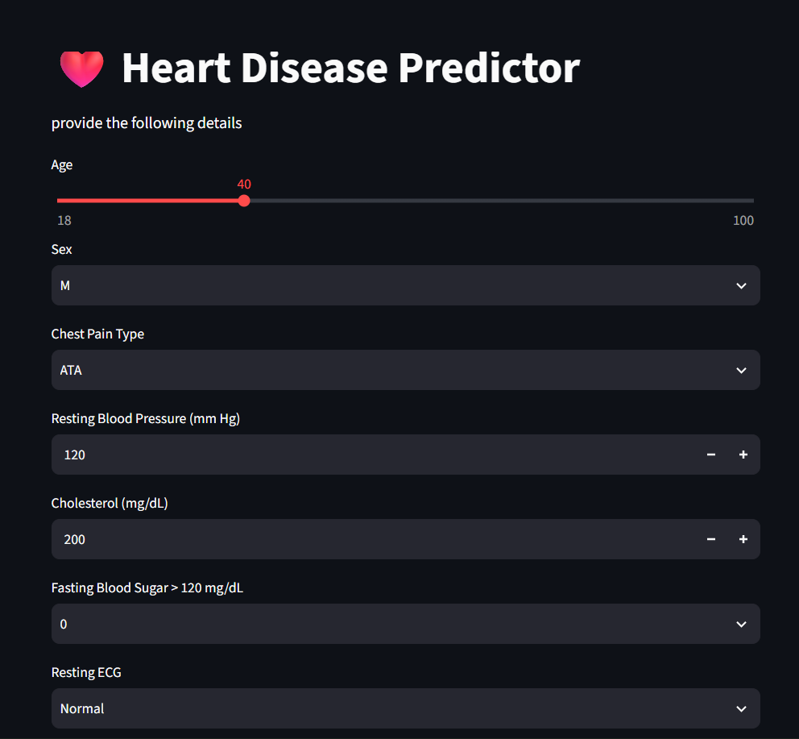
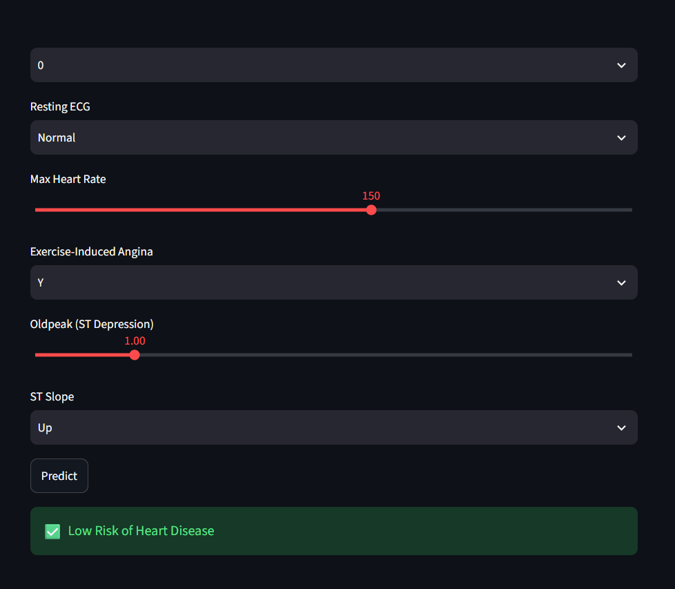

# heart-disease-predictor
# ❤️ Heart Disease Predictor

A Machine Learning web application that predicts the likelihood of heart disease based on a patient's medical information.

This project was built as part of my Machine Learning learning journey using **Python, Scikit-learn, Streamlit, Pandas, and NumPy**.

---


  # ❤️ Heart Disease Prediction

🔗 **Live Demo:** https://heart-disease-predictor-jeet.streamlit.app/

A Machine Learning web application that predicts heart disease risk using Logistic Regression and Streamlit.


### Features

- 📊 Interactive Streamlit interface
- ❤️ Heart disease prediction using Machine Learning
- 🎚️ Sliders for numerical values
- 📋 Dropdown menus for categorical features
- ⚡ Instant prediction
- 🧠 Trained Logistic Regression model

---

## 🖥️ Application Preview


### Home Page



### Prediction Result



---

## 📂 Project Structure


heart-disease-predictor
│
├── app.py                   - Streamlit application
├── heart_project.ipynb      - Model training notebook
├── logistic_heart.pkl       - Trained ML model
├── scaler.pkl               - Feature scaler
├── columns.pkl              - Feature columns
├── heart.xls                - Dataset
└── README.md


 🧠 Machine Learning Workflow

The model was developed using the following steps:

- Data Collection
- Data Cleaning
- Exploratory Data Analysis
- Feature Engineering
- Feature Scaling
- Train-Test Split
- Logistic Regression Model Training
- Model Evaluation
- Model Saving using Pickle

---

## 🛠️ Technologies Used

- Python
- Streamlit
- Pandas
- NumPy
- Scikit-learn
- Matplotlib
- Seaborn
- Jupyter Notebook

---

## 📊 Input Features

The model uses the following patient information:

- Age
- Sex
- Chest Pain Type
- Resting Blood Pressure
- Cholesterol
- Fasting Blood Sugar
- Resting ECG
- Maximum Heart Rate
- Exercise-Induced Angina
- ST Depression (Oldpeak)
- ST Slope

---

## ▶️ Running the Project

Clone the repository

```bash
git clone https://github.com/jeetsaini2580/heart-disease-predictor.git
```

Move into the project directory

```bash
cd heart-disease-predictor
```

Install the required libraries

```bash
pip install -r requirements.txt
```

Run the application

```bash
streamlit run app.py
```

---

## 📚 What I Learned

This project helped me understand:

- Data preprocessing
- Feature scaling
- Classification using Logistic Regression
- Model serialization using Pickle
- Building Machine Learning web applications with Streamlit
- Version control using Git and GitHub

---

## 🎯 Future Improvements

- Improve model accuracy
- Deploy the application online
- Enhance the UI
- Compare multiple Machine Learning algorithms
- Add more health parameters

---

## 👨‍💻 Author

**Jeet Saini**

I'm currently learning Machine Learning and building projects to improve my Python and ML skills.

If you have any suggestions or feedback, feel free to connect with me.
